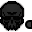
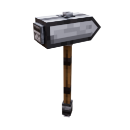

<style>
.oval
{
    width: 220px;
    height: 220px;
    color: #FF0000;
    border-radius: 100%;
    text-align: center;
    font-size: 90px;
    float: right;
    shape-outside: ellipse();
    padding: 20px;
    background-color: #00AAEE;
    background-clip: content-box;
}
span
{
    padding-top: 0px;
    display: inline-block;
}
</style>

# GetStarted

</img> Hey Blockhead, 

<div class="oval">
<span>
</img>
</span>
</div>
<p>
welcome to the wild world of WUT! You might not need to be a master blacksmith, but a trusty hammer is an absolute must. Your first goal? Craft your very own! Sounds simple, right? But remember, hammers in this world are anything but ordinary. Some chat, some brew coffee, and a few even enjoy doing handstands. So grab your tools and let your creativity run wild. And don't forget, a hammer isn't just a tool, it's a friend.
</p>


```md
Well, until you accidentally whack your foot with it.
```


## What exactly can the hammer do?

Think you're strong enough to lift it? You bet! So why not try swinging it at those pesky enemies? Regular attacks with your hammer will weaken your target, making them dizzy and slow.

## Can it mine blocks?
While it's no replacement for a pickaxe, the hammer excels at something no other tool can. If you destroy a block that was once made of smaller pieces, the hammer will break it down into those original components. Just be careful, it's tough on the hammer, so don't overwork it.

## So what else can it do?
A blacksmith's hammer, of course! That's why you should try using it on a Minecraft anvil. Maybe there's something special hidden within, a secret soul just waiting to be discovered. You can't wait to find out, can you? Go ahead and search for an anvil among the blocks!

## Whats Next?

Check out the documentation for the [full list of runtime APIs](https://vitepress.dev/reference/runtime-api#usedata).
